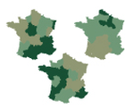

<script src="https://ajax.googleapis.com/ajax/libs/jquery/3.1.1/jquery.min.js"></script>

<style>
.zoomDiv {
  opacity: 0;
  position: fixed;
  top: 50%;
  left: 50%;
  z-index: 50;
  transform: translate(-50%, -50%);
  box-shadow: 10px 10px 50px #888888;
  max-height:100%;
}

.zoomImg {
  width: 100%;
}
</style>


<script type="text/javascript">
  $(document).ready(function() {
    $('body').prepend("<div class=\"zoomDiv\"></div>");
    // onClick function for all plots (img's)
    $('img:not(.zoomImg)').click(function() {
      $('.zoomImg').attr('src', $(this).attr('src'));
      $('.zoomDiv').css({opacity: '1', width: '55%'});
    });
    // onClick function for zoomImg
    $('img.zoomImg').click(function() {
      $('.zoomDiv').css({opacity: '0', width: '0%'});
    });
  });
</script>

```{r setup, echo=FALSE, warning=FALSE, message=FALSE}
knitr::opts_chunk$set(R.options = list(width = 150))

library(knitr)
source("R/chapter_figs.R")
```
# The Birth of Data 

<div class="chapterprelude">
#### Synopsis {-}
This chapter traces the role of data in the initial rise of graphical methods around the early 1800s.
We start with the very idea of numbers used for some wider purpose, and considered what what we now
call "data".
We focus attention on one important participant in this story: André-Michel Guerry [1802--1866], who used an "avalanche of data" and graphical methods to help invent modern social science.
</div>

<div class="chaptercontents">
#### Chapter contents {-}
* Early Numerical Recordings 
	+ Flooding of the Nile 
	+ Ephemeris tables 
* Political Arithmetic 
* The Human Sex Ratio 
* An Avalanche of Numbers 
* Mapping Social Data 
	+ Graphic details matter 
* Stability and Variation 
	+ Seeking Explanations, Causes and Relationships 
	+ Analytical Statistics 
* Re-Visions: Consulting for Guerry 
</div>


## Selected Figures

```{r results="asis", echo=FALSE, message=FALSE, warning=FALSE}
 do_chapter(3)
```
