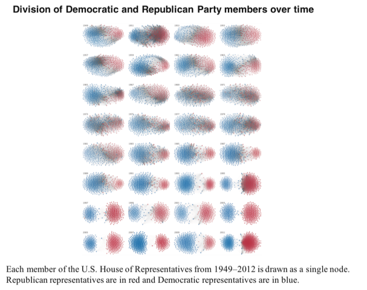
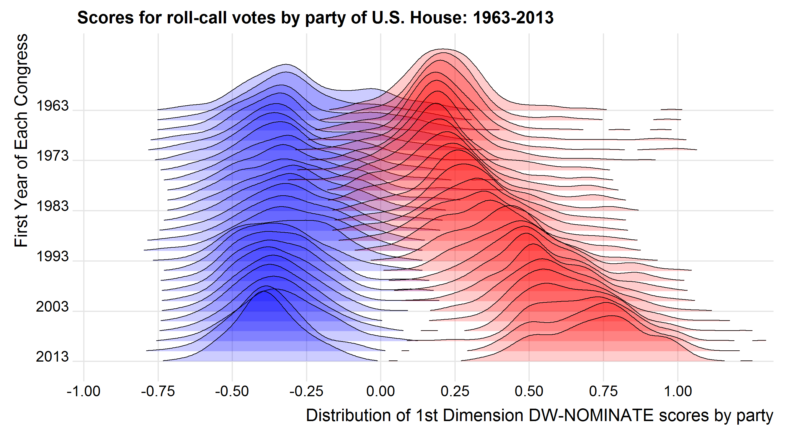

```{r setup, include=FALSE}
knitr::opts_chunk$set(echo = FALSE)
```

With the release of this web site for the book, we began to solicit comments and discussion on the
contents, both of the book, and what we present as a book companion on this web site.

Here are a few topics (in no particular order) with some discussion.

## Optics and data visualization

**Howard Wainer**: It is worth thinking some more about the comparison made in the [New Yorker article](https://www.newyorker.com/magazine/2021/06/21/when-graphs-are-a-matter-of-life-and-death) about the relative value of data visualization vs. the telescope and the microscope.

All three instruments made subsequent scientific advancement possible and it seems sensible to take the comparison seriously and see if data viz is in the same class as these iconic optical tools.
Your thoughts?

**Lee Wilkinson**: Note that today, the statistical analysis/model is intertwined with the visualization. Playfair imagined many of the charts we use today, for example, but he had no conception of the richness of the analytic environment provided through methods like the one here (in this case, graph layout algorithms). The following example, from [^1], concerns members of the US Congress. The entries in the cells of the data matrix are the number of times a given pair of members voted the same way. The authors did this analysis 60 times (60 such matrices), once for each year from 1949 to 2011. The result is a graphic that almost uniquely illustrates the dramatic history of partisanship in US politics.


[^1]:  Andris, C., Lee, D., Hamilton, M.J., Martino, M., Gunning, C.E., Selden, J.A. (2015). The Rise of Partisanship and Super-Cooperators in the U.S. House of Representatives. PLOS ONE https://doi.org/10.1371/ journal.pone.0123507.

{width=60%}

So the equivalent of the telescope and microscope is not rendering capabilities, but the statistical algorithms now provided in tools like R and SYSTAT and Datadesk. 
For those today who think statistics and visualization are separate topics, I can only imagine one of those ironic Tukey smiles questioning their certainty.

**Michael Friendly**: Your network figure, showing increased polarization in the US is similar in intent to Plate 9 in the book.
Goal: show changes in polarization as reflected in votes in the U.S. House of Representatives over time. 

It is interesting to compare these two totally different analyses and graphic methods, and see the same message presented.

* Yours: based on pairwise agreement between House members, using MDS and graph layout.
* Ours: Based on an initial PCA to give scores on a dominant dimension, and then using a ridgeline plot to show the scores of
Dems and Republicans on that dimension.


{width=60%}

**Paul Velleman**: I agree with Lee. But I’d go perhaps a step further. The interplay between visualization and model is itself dynamic since we can now make and modify visualizations so quickly and with so little effort. Rotate a plot, select a subset that has been revealed, and make a new display for just that subset. Color points that group together in one display and be surprised at where they pop up in an entirely different view of the data using different variables. Notice in a display that a subgroup should be isolated, mask it out and find a  regression for the rest of the data and then look at a plot of the residuals as you gradually slide the isolated points back in to the data. (Of course, I think of things you can do in Data Desk. I’m sure there are other examples.)

## ISOTYPE (Otto & Marie Neurath)

A reader of the book wrote:

> I was surprised to learn that [this] volume has no mention of the groundbreaking and creative work by Otto and, later, Marie Neurath (e.g., the Vienna Method and Isotype), which was associated with their equally pioneering exhibitions for museums and the former's participatory and deliberative democratic model of urban planning. 

**Reply**: You are correct that there is no mention of the work of the Neuraths, but it was not for not trying or not being aware of their work.  Our contract with HUP called for 50,000 words; our first draft included much more material (including ISOtype stuff), but clocked in at >90,000 words. We had to fight to get them to agree to ~ 75,000 or so.  Many topics fell off the editors desk, much to our displeasure.  In fact, the entire period, 1900-1950 gets only 2 pages.

Some content on this topic and pointers to relevant literature will be provided under
<!-- _Learning More_ for Chapter 7. -->
[_Learning More_ for Chapter 7](learning_more.html#chapter-7).

## Review by Nick Cox

Reviewed on September 27, 2021 for [Amazon.com](https://www.amazon.com/gp/customer-reviews/R19HUUJRY5UXOY/ref=cm_cr_arp_d_rvw_ttl?ie=UTF8&ASIN=0674975235)

<i class="fa fa-star" color="yellow"></i>
<i class="fa fa-star" color="yellow"></i>
<i class="fa fa-star" color="yellow"></i>
<i class="fa fa-star" color="yellow"></i> (5.0 out of 5 stars)

> A highly readable overview of the history of statistical graphics, intriguing and informative


Data visualization is a broad area and graphic communication broader yet. In a newspaper alone the latter might include photos, puzzles, cartoons, and advertisements as well as graphs and maps. In practice authors Friendly and Wainer are most interested in statistical graphs and maps, and less interested in information graphics or any other kind of graphics beyond that.

A poignant detail: the authors met as undergraduates in 1962, so have known each other nearly 60 years. Both are strongly statistically minded, with shared major interests in psychology, but each has experience and expertise across several application fields. Wainer is well known for many short papers on graphics in journals such as _The American Statistician_, _Chance_ and _Significance_, most of which have been gathered in five previous books. Friendly is a leading authority on graphics for categorical data and has also written several substantial papers on the history of graphics. In coming together for this book they offer a highly readable overview of many of the highlights in the history of statistical graphics, which will be widely appreciated as intriguing and informative.

The title detail "A History" is crucial. The authors could have written a book 2 or 3 times the length of this from their own previous papers. For that reason and others, this is emphatically a selective history with no intent or pretense at completeness. The authors are cheerfully historical in setting contributions in their contemporary context, and equally cheerfully unhistorical in hailing heroes retrospectively and judging past work in the light of the present, making gleeful anachronistic comments along the way on crowd sourcing and grant applications. Indeed, some of the most striking detail arises from exercises re-plotting historic data with modern tools. After an inevitably bitty start, the main focus is on such workers as the peripatetic van Langren; Guerry, Minard, and Marey in France; and Playfair, Herschel, Farr, Snow, and Galton in Britain. Later developments in North America are not neglected.

Enormous scope remains for future work. The authors mention a golden age for graphics in the 19th century, but elsewhere I have mentioned a golden age starting around 1970 first centered on Princeton, Bell Labs, and Harvard and the work of Tukey, Tufte, Cleveland, Chambers, and others, which combined inventiveness in graph designs with modern computing. As is well known, magnificent progress in hardware and software over a few decades took graphs away from specialists in drawing offices and gave their control to scientists, statisticians, and others working at their own computers. Some of this later 20th century work -- especially interactive and dynamic graphics -- is mentioned here. There is continuing need for detailed historical analysis of the ways in which statistical graphics (and exploratory data analysis more generally) both challenged and complemented then current approaches to statistics. Graphical depiction of uncertainty is another understated theme. Who first plotted error bars anywhere? The history of that idea appears to be undocumented in any sustained form.

The authors score high on enthusiasm, entertainment, and enterprise. They and close colleagues have unearthed much splendid work otherwise gathering dust in libraries and archives, at least metaphorically. Unfortunately copy editing and proof-reading has left a peppering of small errors and a few outright howlers. Greek, Latin, German, and French names are the most frequent casualties, but some British details are mangled too, as when Newton's work on calculus is misplaced by a century and Galton's focus on regression to mediocrity is reported in terms of mediocracy, itself a much needed gap in political life. The authors' references are sometimes capricious, missing entire monographs on Playfair, Herschel, Snow, Minard and the history of Venn diagrams, for example. Perhaps these errors and omissions will be made good in the accompanying website.

There was one major disappointment for me. Unlike those in many books in the history of cartography (let alone the history of art), the illustrations are mostly small and often a muddy black and white, with only a short selection in color. It seems that the publishers missed an opportunity for a bold publication that would have appealed widely, far beyond the small number of specialists in this territory.


