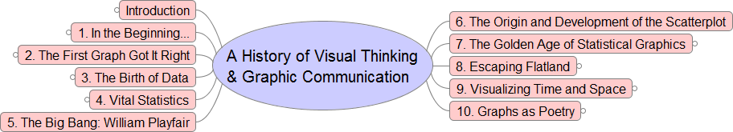

## Welcome

<!--  -->

<table>
<tr>
  <td>
  
  </td>
  <td>
This is the web site associated with our book,
[A History of Data Visualization and Graphic Communication](https://www.hup.harvard.edu/catalog.php?isbn=9780674975231), Harvard University Press, 2021.
Its main purpose is to provide high-res color images of figures from the book, because the print edition was limited
to 20 color plates.

As well, it serves as a place to collect related articles or topics that could not be included in the print edition.
</td>
</tr>
</table>

<table>
<tr>
  <td>
  
  </td>
  <td>
The book can be ordered from:
[Harvard University Press](https://www.hup.harvard.edu/catalog.php?isbn=9780674975231),
[Amazon.com](https://www.amazon.com/History-Data-Visualization-Graphic-Communication/dp/0674975235/) or affiliates, such as [Amazon.ca](https://www.amazon.ca/History-Data-Visualization-Graphic-Communication/dp/0674975235).

[Publishing details](pdf/BookFlier.pdf) are contained in this HUP flyer.
</td>
</tr>
</table>

## Contents

The Chapters menu at the top right presents information and images for the chapters.
Here is a visual overview.

## What it is about

With complex information everywhere, graphics have become indispensable to our daily lives. Navigation apps show real-time, interactive traffic data. Charts communicate stock market trends, government spending, and the dangers of epidemics. 
_A History of Data Visualization & Graphic Communication_ tells the story of how graphics left the exclusive confines of scientific research and became ubiquitous. As data visualization spread, it changed the way we think.
This book is an exploration and celebration of the origins and, to some extent, future of graphical methods of
data presentation.

It aims to give a comprehensive history of data visualization with an emphasis
on the questions: 

* How did the graphic depictions of numbers arise? Why? 
* What factors led to the key innovations in graphs and diagrams that are commonplace today? 
* How did graphic inventions make a difference in understanding natural and social phenomena and communicating results?

Two major themes connect the topics and and chronology of this account. 

* First, we take the view that the principal innovations over the last 400 years arose in
conjunction with a cognitive revolution we call "visual thinking," the idea that
some problems and their solutions could be so much more clearly addressed and
communicated in visual displays, rather than just words or tables of numbers.

* Second, we try to show how the intellectual, scientific and graphical questions
behind these innovations can be better understood by trying to reproduce them
today.

### Introductory chapter

The [introductory chapter](pdf/HistDataVis-Ch0.pdf) gives the origin story of this book and provides and overview
of the book.

